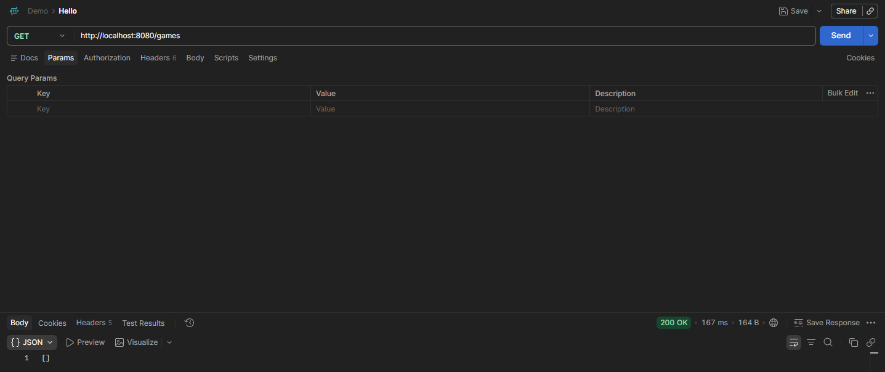
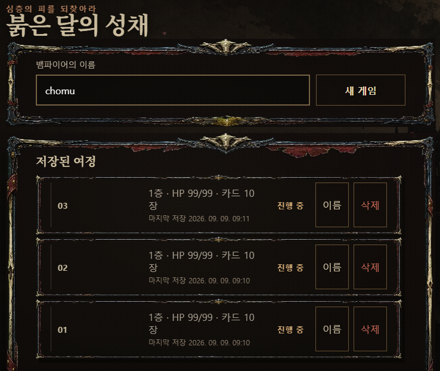
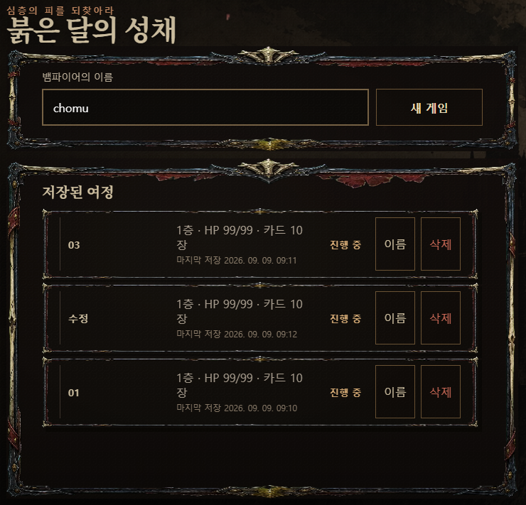
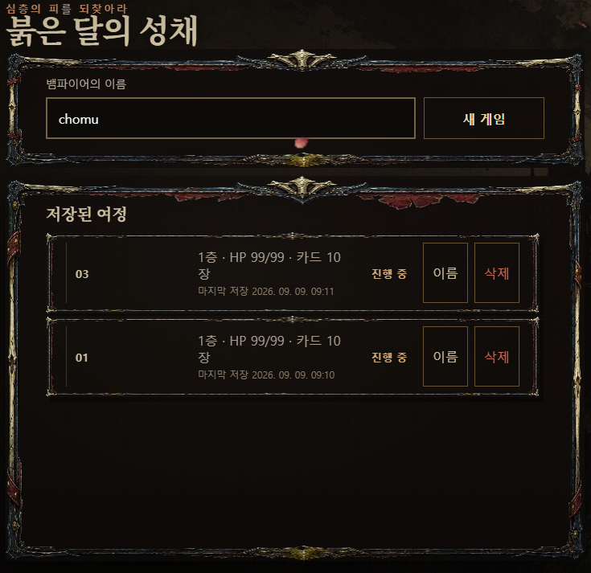
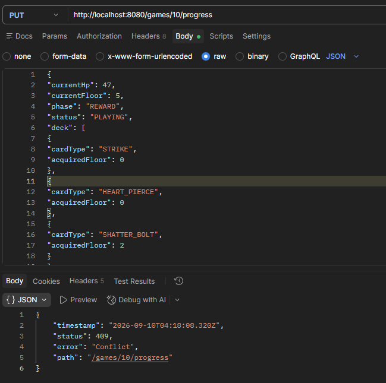

## 필수 기능 구현

**Lv1. 설정 파일 작성 : Docker MySQL 연결**
- [x] Docker로 MySQL을 실행하고, 프로젝트에 환경 변수 설정 파일을 세팅합니다.

<details>
<summary><b>[자세히] </b></summary>

1. Dockerfile 구성
* Java 21 실행 환경 구축 및 실행 가능한 `.jar` 파일 등록

 [Dockerfile 바로가기](./Dockerfile)

---

2. 애플리케이션 아티팩트 빌드
* Docker 이미지 빌드 전, Gradle을 통해 실행 가능한 `.jar` 파일 생성
```bash
./gradlew clean build -x test
```
---
3. docker-compose.yml 구성
MySQL 데이터베이스와 Spring Boot 애플리케이션 컨테이너 묶음 관리

DB 데이터 영속성을 위한 볼륨 마운트 및 healthcheck 조건 적용

 [docker-compose.yml 바로가기](./docker-compose.yml)

---

4. 환경 변수 세팅 (.env)
DB 접속 정보 및 루트 비밀번호 등 보안 민감 정보 분리 (.gitignore 처리)

협업 및 평가용 환경 변수 스키마 제공

 [.env.example 바로가기](./.env.example)
 
---

5. Docker Compose 서비스 실행
설정된 환경 변수와 Compose 파일 기반으로 서비스 일괄 구동

```Bash
# 전체 컨테이너 빌드 및 백그라운드 실행
docker-compose up -d --build

# 실행 상태 확인
docker-compose ps
```

</details>

**Lv2. 의존성 주입(DI)**
- [x]  스프링을 실행 후 로그를 읽고, 어떤 클래스가 빈으로 등록되지 않았는지 찾아 고칩니다.

<details>
<summary><b>[자세히]</b></summary>

```문제 상황 (에러 로그 분석)
my-app | ***************************
my-app | APPLICATION FAILED TO START
my-app | ***************************
my-app |
my-app | Description:
my-app |
my-app | Parameter 0 of constructor in com.gamebasic.game.controller.GameController required a bean of type 'com.gamebasic.game.service.GameService' that could not be found.
my-app |
my-app |
my-app | Action:
my-app |
my-app | Consider defining a bean of type 'com.gamebasic.game.service.GameService' in your configuration.
my-app |
my-app exited with code 1 (restarting)
```
여기서 com.gamebasic.game.controller.GameController 클래스가 생성될 때, 첫 번째 생성자 파라미터(Parameter 0)인 com.gamebasic.game.service.GameService 객체(빈)를 주입받으려고 했으나 찾지 못해 애플리케이션 구동이 실패했다는 뜻입니다.

즉, GameController는 준비되었는데 그 안에 넣어줄 GameService가 스프링 빈으로 등록되지 않아서 발생한 에러입니다.

```java
@Service //추가
@RequiredArgsConstructor
public class GameService {
}
```

@Service 어노테이션을 추가하여 스프링 컨테이너가 해당 클래스를 빈(Bean)으로 자동 등록하도록 유도함으로써 의존성 주입 문제를 해결했습니다.
기술적으로 @Component와 @Service의 동작은 동일하지만, 컨트롤러 계층에 @RestController를 사용하는 것과의 아키텍처 일관성을 유지하고 가독성을 높이기 위해 @Service를 채택했습니다.

</details>

- [x]  확인: 서버가 뜨고 `http://localhost:8080/`에서 아래 게임 타이틀이 열립니다. MySQL에 테이블이 생긴 것도 확인해 보세요.

<details>
<summary><b>[자세히]</b></summary>

```Bash
##docker의 mySQL에 접속
docker exec -it assignment-mysql mysql -u root -p
```

```Bash
##assignment_db 사용
use assignment_db;
```

```Bash
##assignment_db 테이블 보기
show tables;
```

```Bash
+-------------------------+
| Tables_in_assignment_db |
+-------------------------+
| games                   |
| run_cards               |
+-------------------------+
```

</details>

**Lv3. RESTful API: 게임 목록 조회**
- [x] GET http://localhost:8080/games를 호출하면 지금은 405가 나옵니다. 200이 나오게 고쳐야 합니다.
- [x] 확인: 요청이 200과 빈 목록([])을 반환하고, 게임 타이틀이 에러 없이 열립니다.

<details>
<summary><b>[자세히] </b></summary>



</details>

**Lv4. @Transactional**
게임에서는 타이틀 화면까지는 정상이지만, "게임 시작"을 눌러 이름을 입력하고 "새 게임" 버튼을 누르는 순간 저장 단계에서 에러가 납니다.
- [x]  "새 게임"을 눌러 에러를 확인하고 수정합니다.
- [x]  확인: "새 게임"을 누르면 에러 메시지가 아래 오른쪽처럼 `서버 응답이 API 명세와 다릅니다 (deck[0].id)`로 바뀝니다. 저장은 성공했지만 아직 비어 있는 응답 DTO 때문에 나는 메시지입니다.

<details>
<summary><b>[자세히] </b></summary>

```문제 상황(에러 코드)
my-app  | Hibernate: insert into games (current_floor,current_hp,phase,player_name,status) values (?,?,?,?,?)
my-app  | 2026-09-08T06:58:46.993Z  WARN 1 --- [nio-8080-exec-7] org.hibernate.orm.jdbc.error             : HHH000247: ErrorCode: 0, SQLState: S1009
my-app  | 2026-09-08T06:58:46.994Z  WARN 1 --- [nio-8080-exec-7] org.hibernate.orm.jdbc.error             : Connection is read-only. Queries leading to data modification are not allowed
my-app  | 2026-09-08T06:58:46.997Z ERROR 1 --- [nio-8080-exec-7] o.a.c.c.C.[.[.[/].[dispatcherServlet]    : Servlet.service() for servlet [dispatcherServlet] in context with path [] threw exception [Request processing failed: org.springframework.orm.jpa.JpaSystemException: could not execute statement [Connection is read-only. Queries leading to data modification are not allowed] [insert into games (current_floor,current_hp,phase,player_name,status) values (?,?,?,?,?)]] with root cause
my-app  | 
my-app  | java.sql.SQLException: Connection is read-only. Queries leading to data modification are not allowed
my-app  |       at com.mysql.cj.jdbc.exceptions.SQLError.createSQLException(SQLError.java:121) ~[mysql-connector-j-9.7.0.jar!/:9.7.0]
my-app  |       at com.mysql.cj.jdbc.exceptions.SQLError.createSQLException(SQLError.java:89) ~[mysql-connector-j-9.7.0.jar!/:9.7.0]
my-app  |       at com.mysql.cj.jdbc.exceptions.SQLError.createSQLException(SQLError.java:81) ~[mysql-connector-j-9.7.0.jar!/:9.7.0]
my-app  |       at com.mysql.cj.jdbc.exceptions.SQLError.createSQLException(SQLError.java:55) ~[mysql-connector-j-9.7.0.jar!/:9.7.0]
```
여기서 Connection is read-only. Queries leading to data modification are not allowed는 서비스 클래스나, 메서드에 붙어있는 @Transactional에 readOnly = true가 들어가 있어 발생하는 오류입니다.

```java
@Transactional() //readOnly = ture -> 공백 or readOnly = false로 수정
public GameDetailResponse createGame(CreateRequest request) {
}
```


</details>

**Lv5. Bean Validation: 게임 생성**
- [x]  `RunCardRequest`와 `CardResponse` DTO 클래스를 API 명세에 맞게 구현하세요.
- [x]  확인: "새 게임"을 누르면 아래 오른쪽처럼 시작 보상 화면까지 열립니다. 보상을 고르면 에러가 나는 것은 아직 진행 저장 API가 없어서이며 정상입니다.

<details>
<summary><b>[자세히] </b></summary>

```java
@Getter
@RequiredArgsConstructor
public class CardResponse {
    // TODO (Lv 5): API 명세의 카드 응답 JSON에 맞게 필드를 만들고 생성자에서 채우세요.
    private final Long id;
    private final String cardType;
    private final Integer acquiredFloor;

//    public CardResponse(Long id, String cardType, int acquiredFloor) {
//        this.id = id;
//        this.cardType = cardType;
//        this.acquiredFloor = acquiredFloor;
//    }
}
```
"기존 생성자에 id, cardType, acquiredFloor가 있어 API 명세에는 id가 명시되어 있지 않지만 우선 모두 포함하여 생성자를 작성했습니다.
@RequiredArgsConstructor와 직접 생성자를 작성하는 방식은 컴파일 결과물 측면에서는 차이가 없지만, 유지보수성과 생산성 향상을 위해 롬복(Lombok)을 사용하기로 결정했습니다.
생산성과 유지보수성에서 가장 큰 차이가 나는 이유는 필드가 추가될 때마다 일일이 생성자를 수정할 번거로움이 사라지기 때문입니다."

```java
@Getter
public class RunCardRequest {
    // TODO (Lv 5): API 명세의 카드 필드 제약을 Bean Validation 어노테이션으로 붙이세요.

    @NotBlank()
    private String cardType;

    @Min(value = 0)
    @Max(value = 10)
    private Integer acquiredFloor;
}
```


</details>

**Lv6. 보상 카드 선택과 진행 저장**
- [x]  API 문서의 응답(Response) 명세 생성은 해당 API 메서드의 return 타입을 기반으로 생성됩니다. 그런데 return 타입이 ResponseEntity<?>로 타이핑 되어있어 정확한 타입을 알 수 없으니 정확하게 고쳐주세요.

<details>
<summary><b>[자세히] </b></summary>

```java
@PutMapping("/games/{gameId}/progress")
public ResponseEntity<?> updateProgress(
        @PathVariable Long gameId,
        @Valid @RequestBody ProgressRequest request
) {
         return ResponseEntity.ok(gameService.updateProgress(gameId, request));
}

@Transactional
public GameDetailResponse updateProgress(Long gameId, ProgressRequest request) {
}
```
기존 메서드의 반환 타입이 와일드카드(<?>)로 지정되어 있어, 이를 명확한 타입으로 수정하여 타입 안정성을 높였습니다. 
해당 메서드가 반환하는 updateProgress()의 리턴 타입이 GameDetailResponse이므로, ResponseEntity의 제네릭 타입도 GameDetailResponse로 맞춰주었습니다.

</details>

**Lv7. 보상 카드 선택과 진행 저장**
Spring Data JPA가 커스텀 쿼리 메서드로 정렬 조회를 만들어 주는 규칙(OrderBy, Asc, Desc)을 직접 검색해서 문제를 풀어주세요.

- [x]  아래의 코드를 이용하여 게임 목록 조회 API를 구현하세요. 게임 목록은 Game의 id 기준 내림차순입니다.

```java
@GetMapping("/games")
public ResponseEntity<List<GameSummaryResponse>> getGames() {
    return ResponseEntity.ok(gameService.getGames());
}
```

<details>
<summary><b>[자세히] </b></summary>

1. DTO 구성 및 Service 로직 구현
게임 목록 조회 응답에 필요한 정보를 담기 위해 GameSummaryResponse DTO를 정의하고, GameRepository에 findAllByOrderByIdDesc() 쿼리 메서드를 추가했습니다.
getGames() 메서드에서는 DB 전체 카드 목록을 매번 조회하지 않고, Game 엔티티에 역정규화된 deckSize와 생성/수정 시간을 활용하여 단일 쿼리로 최적화된 조회를 수행하도록 구성했습니다.

[GameSummaryResponse 바로가기](./src/main/java/com/gamebasic/game/dto/GameSummaryResponse.java)

[GameRepository 바로가기](./src/main/java/com/gamebasic/game/repository/GameRepository.java)

```java
@Transactional(readOnly = true)
    public List<GameSummaryResponse> getGames() {
        return gameRepository.findAllByOrderByIdDesc().stream()
                .map(game -> new GameSummaryResponse(
                        game.getId(),
                        game.getPlayerName(),
                        game.getCurrentFloor(),
                        game.getCurrentHp(),
                        game.getPhase(),
                        game.getStatus(),
                        game.getDeckSize(),
                        game.getCreatedAt().toString(),
                        game.getUpdatedAt().toString()
                )).toList();

    }
```

---

2. Entity 필드 추가 및 JPA Auditing 적용
Game 엔티티에 deckSize, createdAt, updatedAt 필드를 추가했습니다. 생성/수정 시점의 시간을 서비스 로직에서 수동(LocalDateTime.now())으로 할당하지 않고, Spring Data JPA Auditing을 적용하여 자동으로 관리되도록 개선했습니다.

```java
@Column(nullable = false)
    private int deckSize = 0;

    @CreatedDate
    @Column(nullable = false, updatable = false)
    private LocalDateTime createdAt;

    @LastModifiedDate
    @Column(nullable = false)
    private LocalDateTime updatedAt;
```

아래와 같이 어노테이션을 적용
```java

@EntityListeners(AuditingEntityListener.class)
public class Game {
}

@EnableJpaAuditing
public class GameBasicApplication {
}
```

---

3. Docker MySQL 스키마(Table) 업데이트
엔티티 필드 변경 사항을 실제 Docker MySQL 컨테이너의 games 테이블에 반영하기 위해 ALTER TABLE DDL 쿼리를 실행했습니다.

```bash
# Docker MySQL 컨테이너 접속
docker exec -it assignment-mysql mysql -u root -p

USE assignment_db;

# deck_size, created_at, updated_at 컬럼 추가
ALTER TABLE games 
  ADD COLUMN deck_size INT NOT NULL DEFAULT 0,
  ADD COLUMN created_at DATETIME(6) NULL DEFAULT CURRENT_TIMESTAMP(6),
  ADD COLUMN updated_at DATETIME(6) NULL DEFAULT CURRENT_TIMESTAMP(6) ON UPDATE CURRENT_TIMESTAMP(6);

# 테이블 구조 반영 확인
DESC games;
```

작업 완료 후, API 호출 시 DB 변경 사항이 잘 매핑되어 정상적으로 목록을 반환하는 것까지 검증을 완료했습니다.

</details>

- [x]  아래의 코드를 이용하여 게임 상세 조회 API를 구현하세요.

```java
@GetMapping("/games/{gameId}")
public ResponseEntity<GameDetailResponse> getGame(@PathVariable Long gameId) {
    return ResponseEntity.ok(gameService.getGame(gameId));
}
```

<details>
<summary><b>[자세히] </b></summary>

GameDetailResponse 응답을 구성하기 위해 먼저 gameId로 Game 엔티티를 조회합니다.
이후 해당 Game에 속한 덱(RunCard) 목록을 ID 오름차순으로 조회하고, 이를 CardResponse DTO 목록으로 변환하여 최종 상세 응답 DTO를 생성합니다.

```java
@Transactional(readOnly = true)
    public GameDetailResponse getGame(Long gameId) {
        Game game = findGame(gameId);

        List<RunCard> cards = runCardRepository.findAllByGameOrderByIdAsc(game);
        List<CardResponse> deck = cards.stream()
                .map(card -> new CardResponse(card.getId(), card.getCardType(), card.getAcquiredFloor()))
                .toList();

        return new GameDetailResponse(
                game.getId(),
                game.getPlayerName(),
                game.getCurrentHp(),
                game.getCurrentFloor(),
                game.getPhase(),
                game.getStatus(),
                deck
        );
    }
```


</details>

- [x]  확인: 새로고침 해도 아래처럼 "저장된 여정"에 게임이 남아 있고, 선택하면 저장된 HP·층·덱이 그대로 이어집니다.

<details>
<summary><b>[자세히] </b></summary>


</details>


**Lv8.  더티 체킹: 이름 수정, 자식부터 삭제**
- [x]  아래의 코드를 이용하여 이름 변경 API를 구현하세요. 요청 DTO(RenameRequest)는 새로 만들고, Entity의 rename()메서드를 활용하여 더티 체킹 방식으로 업데이트합니다.

```java
@PatchMapping("/games/{gameId}")
public ResponseEntity<Void> renameGame(
    @PathVariable Long gameId,
    @Valid @RequestBody RenameRequest request
) {
    gameService.renameGame(gameId, request);
    return ResponseEntity.noContent().build();
}
```

<details>
<summary><b>[자세히] </b></summary>

1. 요청 DTO 생성
   변경할 플레이어 이름을 담는 playerName 필드를 추가하고 @NotBlank, @Size 검증 어노테이션을 적용했습니다.

   [RenameRequest 바로가기](./src/main/java/com/gamebasic/game/dto/RenameRequest.java)


2. 응답 타입 및 Controller 수정
   업데이트된 최신 게임 정보를 응답 바디로 전달하기 위해 전체 목록 DTO(GameSummaryResponse)가 아닌 단건 상세 DTO (GameDetailResponse)를 반환하도록 변경했습니다.
   이에 따라 HTTP 상태 코드를 No Content에서 OK로 조정했습니다.

```java
@PatchMapping("/games/{gameId}")
    public ResponseEntity<GameDetailResponse> renameGame(
            @PathVariable Long gameId,
            @Valid @RequestBody RenameRequest request
    ) {
        return ResponseEntity.ok(gameService.renameGame(gameId, request));
    }
```

```java
@Transactional
public GameDetailResponse renameGame(Long gameId, RenameRequest request) {
    Game game = findGame(gameId);
    game.rename(request.getPlayerName());

    return getGame(gameId);
}
```

</details>

- [x]  아래의 코드를 이용하여 삭제 API를 구현하세요. gameId 조건에 맞는 Game과 RunCard가 모두 삭제되어야합니다.

```java
@DeleteMapping("/games/{gameId}")
public ResponseEntity<Void> deleteGame(@PathVariable Long gameId) {
    gameService.deleteGame(gameId);
    return ResponseEntity.noContent().build();
}
```

<details>
<summary><b>[자세히] </b></summary>

1. 외래키(FK) 제약조건을 고려한 삭제 순서 보장
   RunCard 테이블은 Game 테이블의 gameId를 외래키로 참조하고 있습니다.
   따라서 부모 데이터인 Game을 먼저 삭제하려 할 경우 외래키 제약조건 위반 예외 DataIntegrityViolationException가 발생합니다.
   이를 방지하기 위해 자식 데이터인 RunCard 목록을 먼저 삭제(deleteAllByGame)한 후, 부모 데이터인 Game을 삭제(gameRepository.delete)하도록 순서를 보장했습니다.

2. 응답 규격 (HTTP 204 No Content)
   삭제 작업 완료 후 별도의 응답 바디 데이터가 필요 없으므로 ResponseEntity.noContent().build()를 통해 RESTful 규격에 맞추어 No Content를 반환하도록 작성했습니다.

```java
@DeleteMapping("/games/{gameId}")
    public ResponseEntity<Void> deleteGame(@PathVariable Long gameId) {
        gameService.deleteGame(gameId);
        return ResponseEntity.noContent().build();
    }
```

```java
@Transactional
    public void deleteGame(Long gameId) {
        Game game = findGame(gameId);
        runCardRepository.deleteAllByGame(game);
        gameRepository.delete(game);
    }
```

</details>

- [x]  확인: 저장된 여정 목록에서 이름을 바꾸면 새 이름이 표시되고, 삭제하면 게임이 사라집니다.

<details>
<summary><b>[자세히] </b></summary>





</details>

## 도전 기능 구현

**Lv9.  끝난 게임 덮어쓰기 막기**

게임 클라이언트는 끝난 게임에 진행 저장 요청을 보내지 않습니다. 하지만 외부에서 직접 API를 호출하면, 이미 끝난 게임(status가 CLEARED나 FAILED)의 최종 기록을 새 내용으로 덮어써 버리는 버그가 있습니다.
- [x]  끝난 게임인지는 Game의 isFinished() 메서드로 판정하고, 끝난 게임에 대한 진행 저장 요청은 ResponseStatusException으로 409를 반환하고 데이터를 바꾸지 않도록 고치세요.

<details>
<summary><b>[자세히] </b></summary>

GameService의 updateProgress 메서드 실행 시 game.isFinished()를 통해 게임 종료 여부를 먼저 검증하도록 수정했습니다.
게임이 이미 종료된 상태(status가 CLEARED 또는 FAILED)인 경우 HttpStatus.CONFLICT 예외를 발생시켜 기존 게임 정보 및 카드 덱 데이터가 덮어씌워지지 않도록 방어 로직을 구현했습니다.

```java
    public GameDetailResponse updateProgress(Long gameId, ProgressRequest request) {
        Game game = findGame(gameId);

        if (game.isFinished()) {
            throw new ResponseStatusException(HttpStatus.CONFLICT);
        }
```

</details>

- [x]  확인: Postman으로 FAILED인 게임에 PUT /games/{gameId}/progress를 보내면 409가 옵니다.

<details>
<summary><b>[자세히] </b></summary>



</details>